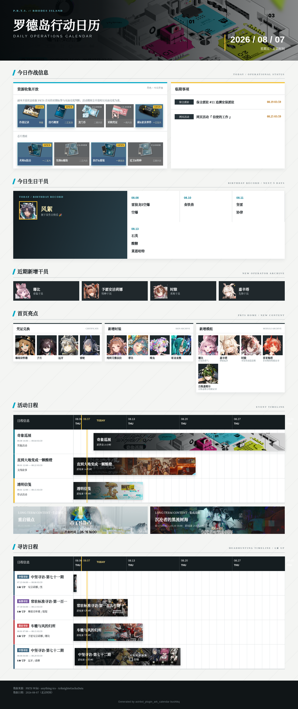
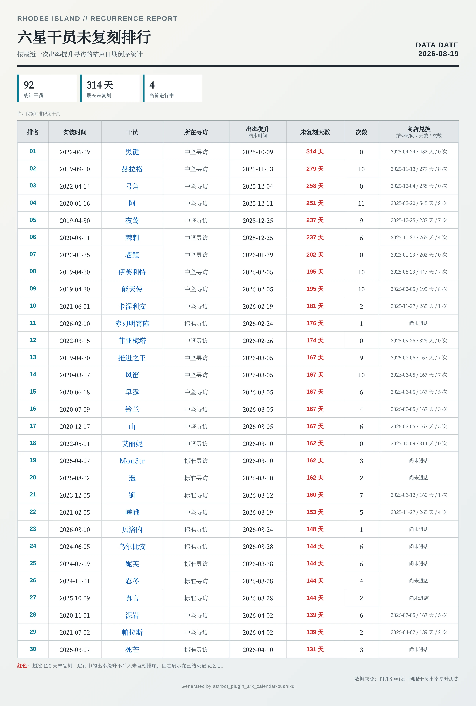
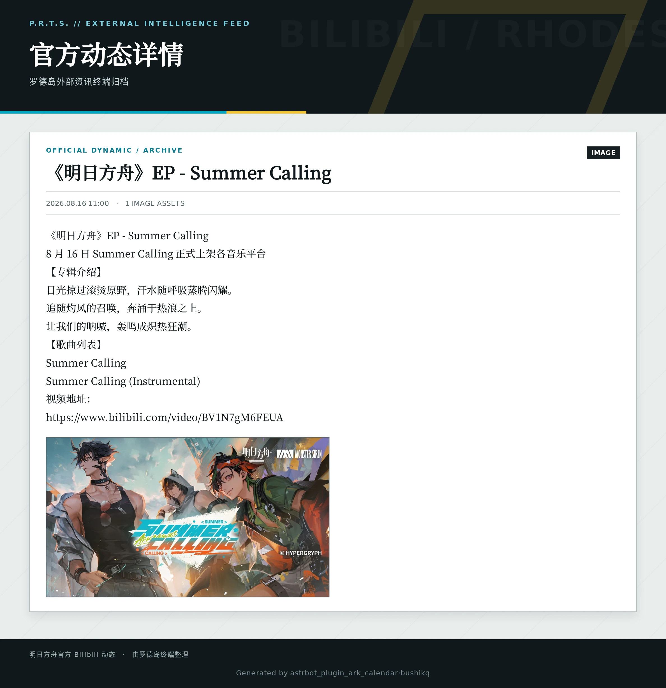
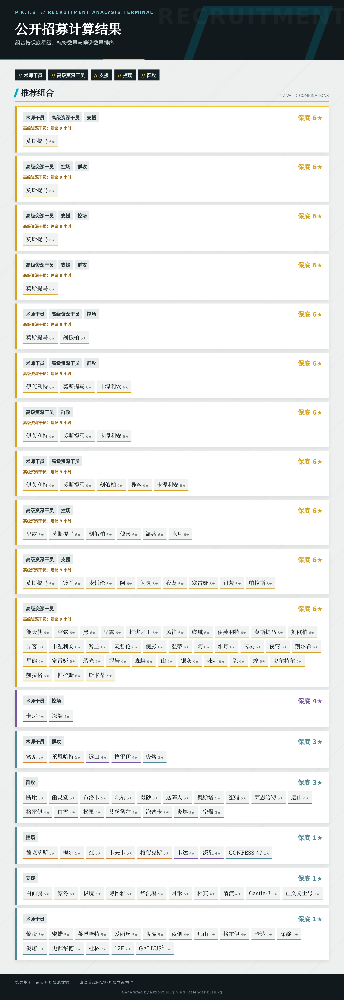
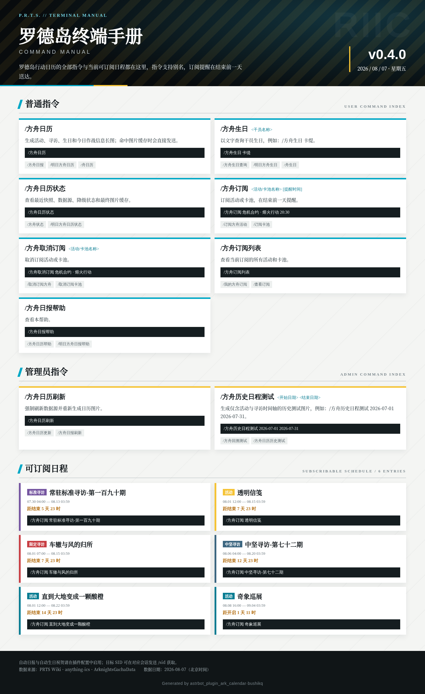

# 罗德岛行动终端 `astrbot_plugin_ark_calendar`

## 访问统计

  

明日方舟信息聚合与查询插件。插件聚合 PRTS、anything-ics、Torappu 与 ArknightsGachaData，生成罗德岛风格的活动、寻访和作战图片，并提供订阅、生日、B站动态和公开招募工具。

当前版本：`v0.9.6`

## 文档导航

- [指令与交互](docs/commands.md)：普通指令、管理员指令、示例和 B站消息发送规则。
- [配置与定时任务](docs/configuration.md)：配置顺序、画质作用范围、自动任务、订阅和 B站推送。
- [安装、文案与运行数据](docs/operation.md)：安装要求、消息风格、缓存目录和数据来源。
- [版本更新记录](CHANGELOG.md)

## 功能概览

- 今日作战信息、活动与寻访时间轴、卡池详情和干员生日。
- 活动与卡池订阅提醒，支持群聊 @ 行为。
- 官方 B站动态查询与推送，支持文字、图片、视频动态和转发筛选。
- 公开招募标签计算、别名识别和招募终端图片；按游戏内 9 小时规则计算保底，支持不限制输入词条数量。
- 公招参数为 `all` 或 `*` 时触发阿米娅彩蛋，不渲染图片。
- 干员未复刻排行榜：按最近一次出率提升寻访结束时间统计，并展示商店兑换历史。
- 日报、历史日程、帮助图、公招图和 B站动态图均支持清晰度档位。
- 图片指令在渲染前发送进度文案，支持猫娘、极简和自定义三套消息风格。
- 数据快照、最终图片、帮助图和网络资源缓存，以及异常降级通知。

## 快速开始

1. 将插件目录放入 AstrBot 的 `data/plugins/`。
2. 在 WebUI 安装依赖并启用插件。
3. 发送 `/方舟日历帮助`（或 `/方舟终端帮助`、`/明日方舟终端帮助`）查看当前指令和配置说明。

详细安装要求、T2I 服务和运行目录见[安装、文案与运行数据](docs/operation.md)。

## 效果预览

### 1. 日历总览

展开查看日历总览

  

### 2. 未复刻排行

展开查看未复刻排行

  

### 3. B 站动态

  

### 4. 公招计算

展开查看公招计算结果

  

### 5. 指令手册

展开查看指令手册

  

QQ 手机端可能会对较短的长图采用不同的预览缩放策略，导致文字看起来不清晰。实测表明，在宽度、字体和渲染设置不变时，增加图片总高度可能改善手机端显示效果。如需提高原始输出质量，请使用 PNG 并将渲染清晰度设为 `high` 或 `ultra`。

## 问题反馈

欢迎通过 [GitHub Issue](https://github.com/zhewang448/astrbot_plugin_ark_calendar/issues) 反馈问题、提出功能建议或分享使用体验。尽量附上相关日志。

## 🙏 致谢

感谢以下数据来源和项目：

- [PRTS Wiki](https://prts.wiki)：首页今日信息、活动详情、卡池表格、干员资料、未复刻历史与图片。
- [anything-ics](https://github.com/SmallZombie/anything-ics)：活动时间与干员生日。
- [Torappu / Arknights Asset Storage](https://torappu.prts.wiki/gamedata/latest/excel/gacha_table.json)：最新卡池开关时间、规则类型和卡池 ID。
- [ArknightsGachaData](https://github.com/s-yh-china/ArknightsGachaData)：补充正式名称、历史类型和 ID，并作为时间轴回退源。
- [PRTS Gacha Server Data](https://weedy.prts.wiki/)：补全卡池六星 UP 信息。

本插件使用的游戏图片版权属于上海鹰角网络科技有限公司及其关联公司；PRTS 页面内容遵循其站点声明。本项目仅用于非商业信息展示。
